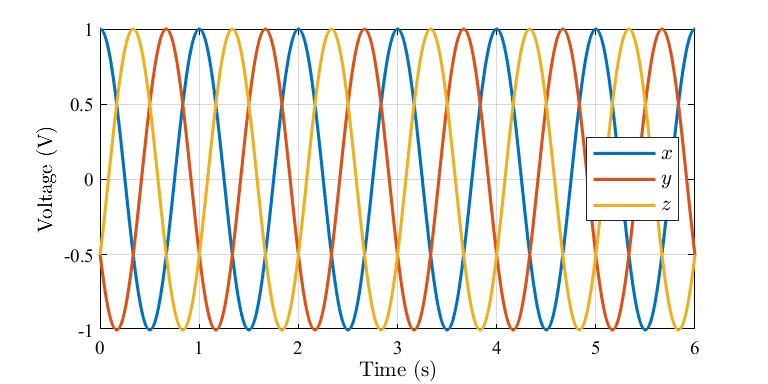

# formatedPlot.m

## Overview

**formatedPlot.m** is a script file for ploting and saving graphs in MATLAB. It posseses the following characteristics:

- Developed with MATLAB R2019b;
- It is specially useful for importing automatically in LaTeX code (use .eps format for better quality);

## Usage

Download this project and run the `example.m` script using your MATLAB. It should save a graph like this:

